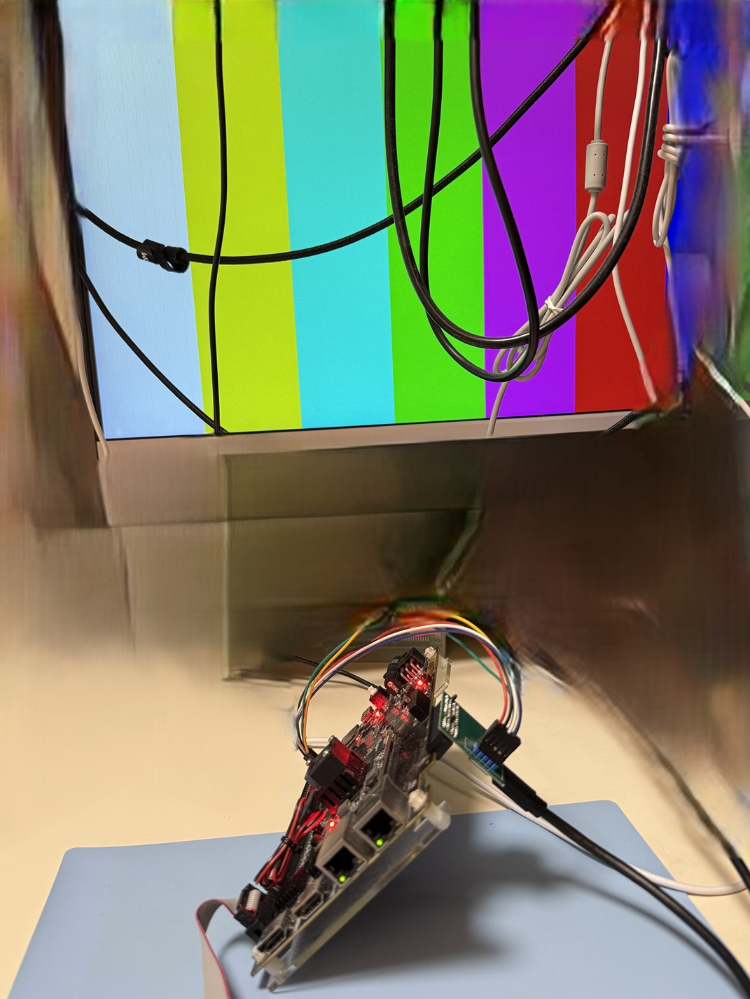

# Renew project from Mike Field DisplayPort Verilog"

## If this project is constructive, welcome to donate a drink to PayPal.

or 

paypal.me/briansune

### This project aimed to fix and verify Mike Field DP project.

### FPGA Tested

1) ✅ Xilinx - 7 series ALINX AC7100 (Artix 7)

### Tested resolution

1) ✅ 1080p 2 channel 60Hz

2) ✅ 1080p 4 channel 60Hz

3) ✅ 1440p 4 channel 60Hz

### Image

### ToDo

1) eDP support

2) cleanup lane support

3) parametric resolution

4) auto TU package producer
